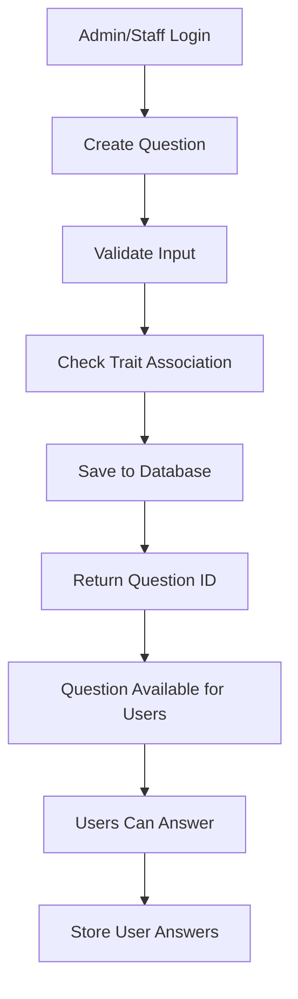
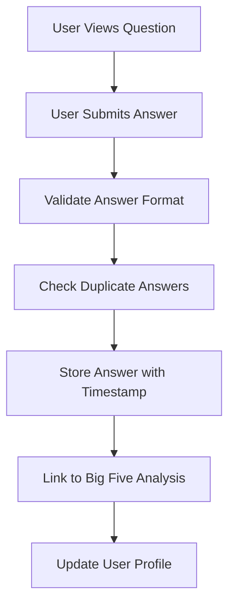

# Green MindMap Backend API Documentation

## Overview
Green MindMap Backend is a RESTful API built with TypeScript, Express.js, and TypeORM that provides comprehensive functionality for personality assessment, food tracking, and user management system.

## Base URL
```
http://localhost:3000/api
```

## Authentication
Most endpoints require JWT authentication. Include the access token in:
- **Cookie**: `access_token`
- **Header**: `Authorization: Bearer <token>`

## API Endpoints

### 🔐 Authentication & Users

#### POST `/api/users/register`
Register a new user with email and password.
```json
{
  "email": "user@example.com",
  "password": "password123",
  "confirm_password": "password123",
  "full_name": "John Doe",
  "date_of_birth": "1990-01-01"
}
```

#### POST `/api/users/login`
Login with email and password.
```json
{
  "email": "user@example.com",
  "password": "password123"
}
```

#### GET `/api/users/profile`
Get current user profile (requires authentication).

#### PUT `/api/users/profile`
Update user profile (requires authentication).

### 🧠 Big Five Personality Assessment

#### POST `/api/big-five`
Create Big Five personality data (requires authentication).
```json
{
  "openness": 0.8,
  "conscientiousness": 0.7,
  "extraversion": 0.6,
  "agreeableness": 0.9,
  "neuroticism": 0.3,
  "userId": "user-uuid"
}
```

#### GET `/api/big-five/:id`
Get Big Five data by ID (requires authentication).

#### GET `/api/big-five/user/:userId`
Get Big Five data by User ID (requires authentication).

#### PUT `/api/big-five/:id`
Update Big Five data (requires authentication).

#### DELETE `/api/big-five/:id`
Delete Big Five data (requires authentication).

#### GET `/api/big-five`
Get all Big Five data (admin only).

### ❓ Questions Management

#### POST `/api/questions/create-question`
Create a new question (requires staff/admin privileges).
```json
{
  "question": "How do you handle stressful situations?",
  "trait": 4,
  "placeholders": "stress, coping",
  "expected_answer": "Calm and collected approach"
}
```

#### GET `/api/questions/get-question`
Get all questions.

#### GET `/api/questions/get-question-by-id/:id`
Get specific question by ID.

#### PUT `/api/questions/update-question/:id`
Update question (requires staff/admin privileges).
```json
{
  "question": "Updated question text",
  "trait": 3,
  "placeholders": "updated, keywords",
  "expected_answer": "Updated expected answer"
}
```

#### DELETE `/api/questions/delete-question/:id`
Delete question (admin only).

### 📝 User Answers

#### POST `/api/user-answers`
Submit answer to a question (requires authentication).
```json
{
  "userId": "user-uuid",
  "questionId": "question-uuid",
  "answer": "My detailed answer to the question",
  "timestamp": "2025-01-01T10:00:00Z"
}
```

#### GET `/api/user-answers/user/:userId`
Get all answers by user ID (requires authentication).

#### GET `/api/user-answers/:userId/:questionId`
Get specific user answer (requires authentication).

#### PUT `/api/user-answers/:userId/:questionId`
Update user answer (requires authentication).

#### DELETE `/api/user-answers/:userId/:questionId`
Delete user answer (requires authentication).

### 🏷️ Traits Management

#### POST `/api/traits`
Create new trait (staff/admin only).
```json
{
  "name": "Openness",
  "description": "Openness to experience trait",
  "label": "openness"
}
```

#### GET `/api/traits/:id`
Get trait by ID.

#### PUT `/api/traits/:id`
Update trait (staff/admin only).

#### DELETE `/api/traits/:id`
Delete trait (admin only).

### 🧵 Thread Halls

#### POST `/api/thread-halls`
Create thread hall (staff/admin only).
```json
{
  "name": "Creativity Discussion",
  "description": "Discussion about creative thinking",
  "traitsId": "trait-uuid"
}
```

#### GET `/api/thread-halls/:id`
Get thread hall by ID.

#### GET `/api/thread-halls/trait/:traitId`
Get thread halls by trait ID.

### 🎭 Behaviors

#### POST `/api/behaviors`
Create behavior (staff/admin only).
```json
{
  "name": "Creative Problem Solving",
  "type": "cognitive",
  "keywords": ["creative", "innovative", "problem-solving"],
  "description": "Ability to find creative solutions",
  "threadHallId": "threadhall-uuid"
}
```

#### GET `/api/behaviors/:id`
Get behavior by ID.

#### GET `/api/behaviors/threadhall/:threadHallId`
Get behaviors by thread hall ID.

### 🍎 Food Tracking

#### POST `/api/food-items`
Create food item (staff/admin only).
```json
{
  "name": "Apple",
  "calories_per_100g": 52,
  "protein": 0.3,
  "carbs": 14,
  "fat": 0.2
}
```

#### GET `/api/food-items`
Get all food items.

#### POST `/api/scans`
Create food scan (requires authentication).
```json
{
  "userId": "user-uuid",
  "foodItemsId": "food-item-uuid",
  "scan_time": "2025-01-01T12:00:00Z"
}
```

#### GET `/api/scans/user/:userId`
Get user's scans (requires authentication).

### 📊 Templates & Locations

#### GET `/api/templates`
Get all templates.

#### GET `/api/locations`
Get user locations (requires authentication).

#### POST `/api/locations`
Create location (requires authentication).

## Question Creation Flow

### 1. Prerequisites
- Admin or Staff role required
- Valid JWT token
- Understanding of trait system (1-5 scale)

### 2. Question Creation Process



### 3. Question Structure

```typescript
interface Question {
  id: string;                    // Auto-generated UUID
  question: string;              // The actual question text
  trait: number;                 // Trait ID (1-5): 1=Openness, 2=Conscientiousness, etc.
  placeholders: string;          // Keywords for question categorization
  expected_answer: string;       // Expected type of answer
  template: Template;            // Associated template
  threadHall: ThreadHall;        // Associated discussion thread
  createdAt: Date;
  updatedAt: Date;
}
```

### 4. Answer Collection Flow



### 5. Question Management

#### Creating Questions
1. **Authentication**: Ensure user has staff/admin role
2. **Validation**: Validate question text and trait association
3. **Storage**: Save question with relationships
4. **Availability**: Question becomes available to users

#### Answer Processing
1. **User Submission**: Users submit answers through `/api/user-answers`
2. **Validation**: Check answer format and user authentication
3. **Storage**: Store answer with user and question relationship
4. **Analysis**: Process answers for personality insights

## Error Handling

All endpoints return consistent error responses:

```json
{
  "message": "Error description",
  "error": "Detailed error information (development only)"
}
```

### Common HTTP Status Codes
- `200`: Success
- `201`: Created
- `400`: Bad Request (validation error)
- `401`: Unauthorized (missing/invalid token)
- `403`: Forbidden (insufficient privileges)
- `404`: Not Found
- `500`: Internal Server Error

## Data Models

### User
```typescript
{
  id: string;
  username: string;
  email: string;
  fullName: string;
  role: "user" | "staff" | "admin";
  dateOfBirth: Date;
  createdAt: Date;
  updatedAt: Date;
}
```

### Question
```typescript
{
  id: string;
  question: string;
  trait: number;
  placeholders: string;
  expected_answer: string;
  createdAt: Date;
  updatedAt: Date;
}
```

### UserAnswer
```typescript
{
  userId: string;
  questionId: string;
  answer: string;
  timestamp: Date;
  createdAt: Date;
  updatedAt: Date;
}
```

### BigFive
```typescript
{
  id: string;
  openness: number;        // 0-1 scale
  conscientiousness: number;
  extraversion: number;
  agreeableness: number;
  neuroticism: number;
  userId: string;
}
```

## Rate Limiting & Security

- JWT token expiration: 24 hours
- Token blacklisting supported
- Input validation with Zod schemas
- SQL injection protection via TypeORM
- CORS enabled for frontend integration

## Development

### Environment Variables
```
DB_HOST=localhost
DB_PORT=5432
DB_USERNAME=postgres
DB_PASSWORD=password
DB_DATABASE=mindmap
JWT_SECRET=your-secret-key
JWT_EXPIRES_IN=24h
```

### Running the Application
```bash
npm install
npm run dev
```

### Testing
```bash
npm test
```

## Support

For questions and support, please contact the development team or refer to the project documentation.
